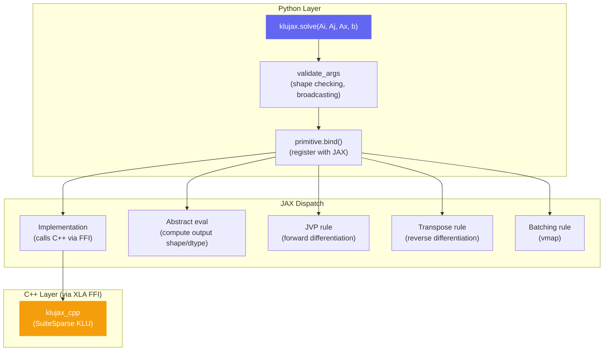
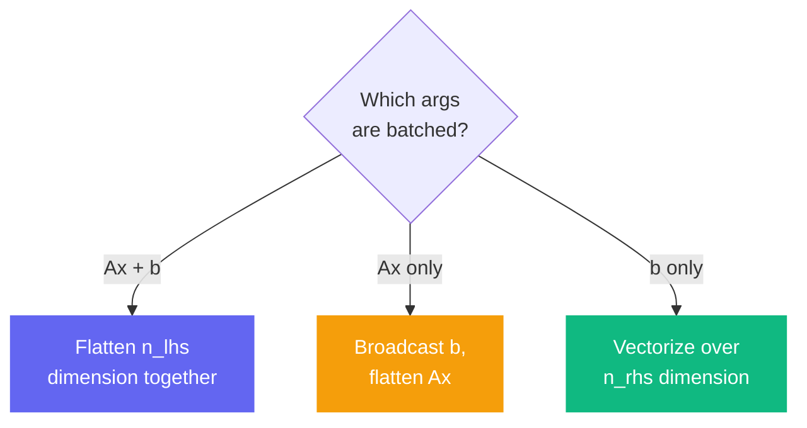

# JAX Integration

klujax is a first-class JAX citizen. Every operation is registered as a JAX primitive with full support for JIT compilation, automatic differentiation, and vectorized batching.

## JIT Compilation

`klujax.solve` and `klujax.dot` are already wrapped with `@jax.jit`. You can also JIT your own functions that call klujax:

```python
@jax.jit
def my_pipeline(Ax, b):
    x = klujax.solve(Ai, Aj, Ax, b)
    return klujax.dot(Ai, Aj, Ax, x) - b  # residual
```

The split API functions (`solve_with_symbol`, `solve_with_numeric`, `factor`, `refactor`) are also JIT-compatible via internal wrappers.

## How It Works Under the Hood



## Automatic Differentiation

### Forward Mode (JVP)

klujax registers JVP (Jacobian-Vector Product) rules for `solve` and `dot`:

**For solve** (x = A⁻¹b):
```
dx = A⁻¹(db - dA @ x)
```

**For dot** (b = A @ x):
```
db = dA @ x + A @ dx
```

This means `jax.jacfwd` and `jax.jvp` work automatically:

```python
# Forward Jacobian w.r.t. Ax
primals, tangents = jax.jvp(
    lambda ax: klujax.solve(Ai, Aj, ax, b),
    (Ax,),
    (dAx,),  # tangent direction
)
```

### Reverse Mode (VJP / Transpose)

klujax registers transpose rules for reverse-mode AD:

**For solve** (backward through x = A⁻¹b):

- Gradient w.r.t. **b**: solve A^T @ g = cotangent (a transpose system)
- Gradient w.r.t. **Ax**: computed from cotangent and solution x

**For dot** (backward through b = A @ x):

- Gradient w.r.t. **x**: multiply cotangent by A^T (transpose matrix)
- Gradient w.r.t. **Ax**: point-wise product at nonzero positions

```python
# Reverse Jacobian w.r.t. b
J = jax.jacrev(lambda bb: klujax.solve(Ai, Aj, Ax, bb))(b)
```

### What's Differentiable?

| Parameter | Differentiable? | Why |
|-----------|----------------|-----|
| `Ax` | Yes | Continuous matrix values |
| `b` / `x` | Yes | Continuous vectors |
| `Ai`, `Aj` | No | Integer indices — not continuous |
| `symbolic` | No | Opaque C++ pointer |
| `numeric` | No | Opaque C++ pointer |

## Vectorized Batching (vmap)

klujax registers batching rules so `jax.vmap` works naturally.

### What Can Be Batched

| Parameter | Batchable? | Notes |
|-----------|-----------|-------|
| `Ax` | Yes | Different matrix values per batch |
| `b` / `x` | Yes | Different vectors per batch |
| `Ai`, `Aj` | No | Sparsity pattern is shared |
| `numeric` | Yes | Different factorizations per batch |
| `symbolic` | No | Analysis result is shared |

### Batching Strategies

klujax automatically picks the best strategy based on which arguments are batched:



### Example

```python
import jax

# Batch over 8 different matrices
Ax_batch = jnp.ones((8, n_nz))

# Method 1: Built-in batching (Ax has shape (n_lhs, n_nz))
x = klujax.solve(Ai, Aj, Ax_batch, b)

# Method 2: vmap (adds extra dimension)
x = jax.vmap(klujax.solve, in_axes=(None, None, 0, None))(Ai, Aj, Ax_batch, b)
```

## Primitives

Under the hood, klujax defines separate JAX primitives for float64 and complex128:

| Operation | float64 | complex128 |
|-----------|---------|------------|
| solve | `solve_f64` | `solve_c128` |
| dot | `dot_f64` | `dot_c128` |
| solve_with_symbol | `solve_with_symbol_f64` | `solve_with_symbol_c128` |
| factor | `factor_f64` | `factor_c128` |
| refactor | `refactor_f64` | `refactor_c128` |
| solve_with_numeric | `solve_with_numeric_f64` | `solve_with_numeric_c128` |
| analyze | `analyze_p` | — |
| free_symbolic | `free_symbolic_p` | — |
| free_numeric | `free_numeric_p` | — |

The Python API automatically dispatches to the correct primitive based on input dtypes.

## KLUHandleManager as JAX Pytree

The `KLUHandleManager` is registered as a JAX pytree node, which is what allows it to be passed through JIT boundaries:

```python
# This works because KLUHandleManager is a pytree
@jax.jit
def solve_with_handle(Ax, b, sym):
    return klujax.solve_with_symbol(Ai, Aj, Ax, b, sym)
```

The handle's uint64 pointer is the "leaf" and ownership metadata is the "aux data" that travels alongside it.
