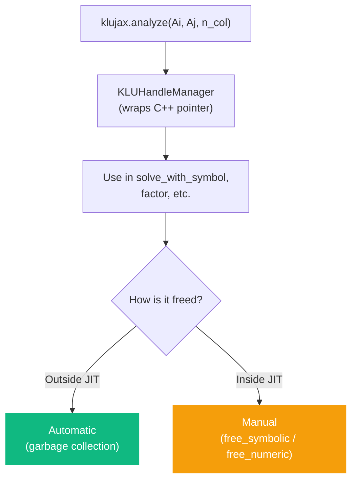
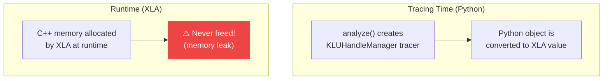
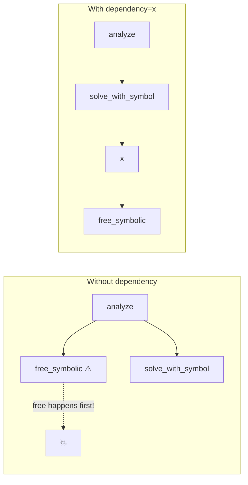

# Memory Management

When you use the split API (`analyze`, `factor`, `refactor`), klujax creates C++ objects that live outside Python's memory management. The `KLUHandleManager` wrapper handles cleanup, but there are important rules to follow.

## The Basics



## Outside JIT (The Easy Case)

When you create handles in regular Python code, cleanup is automatic:

```python
# Option 1: Automatic cleanup (recommended)
symbolic = klujax.analyze(Ai, Aj, n_col)
x = klujax.solve_with_symbol(Ai, Aj, Ax, b, symbolic)
# `symbolic` is freed when garbage collected

# Option 2: Context manager (explicit scope)
with klujax.analyze(Ai, Aj, n_col) as symbolic:
    x = klujax.solve_with_symbol(Ai, Aj, Ax, b, symbolic)
# Freed when exiting the `with` block

# Option 3: Explicit close
symbolic = klujax.analyze(Ai, Aj, n_col)
x = klujax.solve_with_symbol(Ai, Aj, Ax, b, symbolic)
symbolic.close()
```

## Inside JIT (The Tricky Case)

When `analyze` or `factor` is called inside a `jax.jit` function, the Python `KLUHandleManager` is converted to a symbolic tracer during tracing. The C++ pointer is allocated at runtime by XLA, but XLA doesn't know how to free it.

### The Ghost Pointer Problem



### The Fix: Explicit Free with Dependency

```python
@jax.jit
def solve_inside_jit(Ai, Aj, Ax, b):
    # Handle created inside JIT — will leak without explicit free
    sym = klujax.analyze(Ai, Aj, 5)

    x = klujax.solve_with_symbol(Ai, Aj, Ax, b, sym)

    # Tell XLA: free sym AFTER x is computed
    klujax.free_symbolic(sym, dependency=x)

    return x
```

The `dependency` parameter is critical — it prevents XLA from reordering the free before the solve.

### Why dependency Matters

Without it, XLA might execute operations in any order:



## Best Practice: Create Outside, Use Inside

The simplest and safest pattern:

```python
# Create in Python (automatic cleanup)
symbolic = klujax.analyze(Ai, Aj, n_col)

# Use inside JIT (no memory management needed)
@jax.jit
def fast_solve(Ax, b, sym):
    return klujax.solve_with_symbol(Ai, Aj, Ax, b, sym)

# Call many times
for t in range(1000):
    x = fast_solve(Ax_t, b_t, symbolic)

# symbolic is freed when it goes out of scope
```

## KLUHandleManager Details

The handle manager tracks:

| Property | Description |
|----------|-------------|
| `handle` | uint64 pointer to C++ object |
| `_owner` | Whether this manager owns the pointer (prevents double-free) |
| `_freed` | Whether the resource has already been freed |

### Safety Features

- **Double-free prevention**: If you call `close()` and then the garbage collector runs, the second free is skipped.
- **Ownership tracking**: When handles are copied (e.g., through pytree operations), only the owner frees the resource.
- **Warning on JIT creation**: If `analyze` or `factor` detects it's being called during JIT tracing, it prints a `UserWarning` to alert you about potential memory leaks.

## Rules of Thumb

1. **Always create handles outside JIT** when possible
2. **One handle, one free** — don't manually free and also let it go out of scope
3. **If you see the warning** "Allocating KLU handle inside JIT" — you have a memory leak. Fix it with the dependency pattern.
4. **Numeric handles from batched factor** contain multiple pointers — `free_numeric` frees all of them

## Full Lifecycle Example

```python
import klujax

# === Setup ===
symbolic = klujax.analyze(Ai, Aj, n_col)
numeric = klujax.factor(Ai, Aj, Ax, symbolic)

# === Use ===
for step in range(num_steps):
    # Update factorization if matrix changed
    if matrix_changed:
        numeric = klujax.refactor(Ai, Aj, Ax_new, numeric, symbolic)

    # Solve
    x = klujax.solve_with_numeric(numeric, b, symbolic)

# === Cleanup (optional — happens automatically) ===
numeric.close()
symbolic.close()
```
