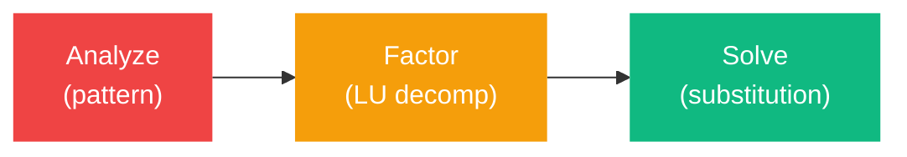
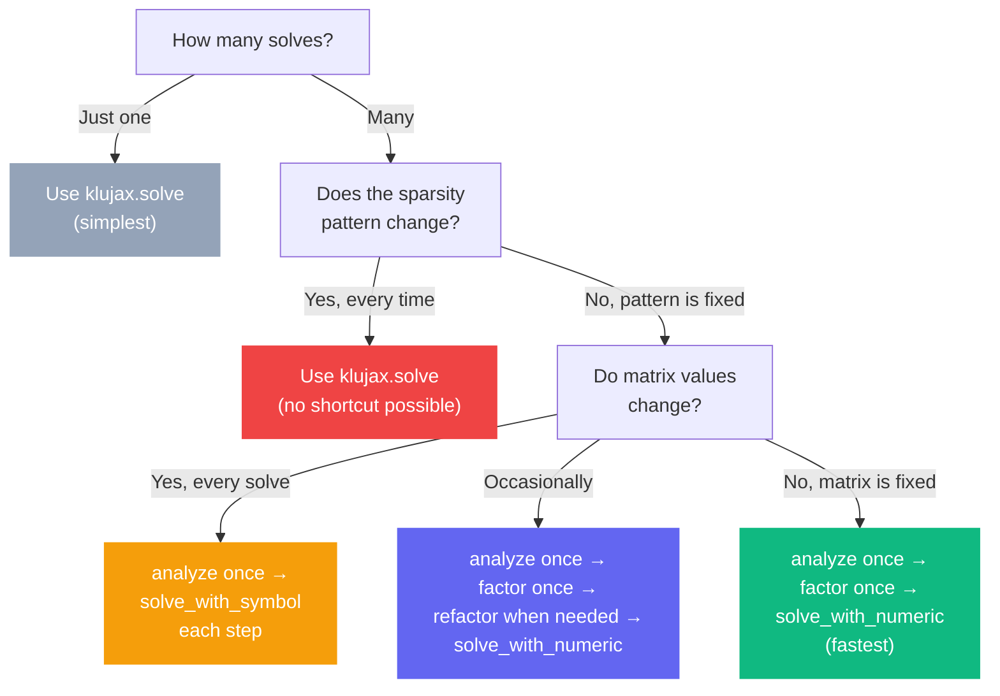
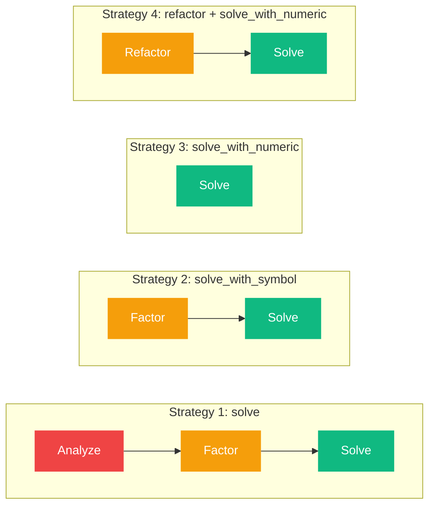

# Performance Guide

klujax gives you control over which parts of the solve to run and when. Choosing the right strategy can make your code orders of magnitude faster.

## The Three Stages

Every sparse solve has three stages with very different costs:



| Stage       | What It Does                                 | Cost      | Depends On          |
| ----------- | -------------------------------------------- | --------- | ------------------- |
| **Analyze** | Find optimal orderings from sparsity pattern | Expensive | Ai, Aj              |
| **Factor**  | LU decomposition (A = LU)                    | Moderate  | Ax (values)         |
| **Solve**   | Forward/backward substitution                | Cheap     | b (right-hand side) |

## Decision Tree



## Strategy 1: All-in-One (klujax.solve)

**When to use:** One-off solves, prototyping, or when the sparsity pattern changes every time.

```python
x = klujax.solve(Ai, Aj, Ax, b)
```

Runs: analyze → factor → solve. Every call.

## Strategy 2: Reuse Symbolic (analyze + solve_with_symbol)

**When to use:** The sparsity pattern is constant, but values and right-hand side change every iteration.

**Typical use case:** Transient simulations, time-stepping.

```python
symbolic = klujax.analyze(Ai, Aj, n_col)  # once

for t in range(steps):
    x = klujax.solve_with_symbol(Ai, Aj, Ax[t], b[t], symbolic)
```

Runs per step: factor → solve. Skips analyze.

## Strategy 3: Reuse Numeric (analyze + factor + solve_with_numeric)

**When to use:** The matrix is constant and only b changes.

**Typical use case:** Modified Newton-Raphson (reuse Jacobian), multiple load cases.

```python
symbolic = klujax.analyze(Ai, Aj, n_col)  # once
numeric = klujax.factor(Ai, Aj, Ax, symbolic)  # once

for i in range(iterations):
    x = klujax.solve_with_numeric(numeric, b[i], symbolic)
```

Runs per step: solve only. Skips analyze and factor.

## Strategy 4: Refactor (analyze + factor + refactor loop)

**When to use:** Matrix values change, but you want to update the factorization in-place rather than creating a new one.

**Typical use case:** Full Newton-Raphson with Jacobian updates.

```python
symbolic = klujax.analyze(Ai, Aj, n_col)
numeric = klujax.factor(Ai, Aj, Ax_initial, symbolic)

for t in range(steps):
    numeric = klujax.refactor(Ai, Aj, Ax[t], numeric, symbolic)
    x = klujax.solve_with_numeric(numeric, b[t], symbolic)
```

Runs per step: refactor → solve. Refactor is slightly faster than factor because it reuses allocated memory.

## Strategy Comparison



## Batching for Throughput

When solving many independent systems, use batching instead of loops:

```python
# BAD: Python loop
for i in range(100):
    x[i] = klujax.solve(Ai, Aj, Ax[i], b[i])

# GOOD: Batched (single kernel launch)
x = klujax.solve(Ai, Aj, Ax_batch, b_batch)

# ALSO GOOD: vmap (single kernel launch)
x = jax.vmap(klujax.solve, in_axes=(None, None, 0, 0))(Ai, Aj, Ax_batch, b_batch)
```

Batched operations launch a single optimized kernel instead of 100 separate ones.

## Tips

1. **Profile first.** Don't optimize until you know where time is spent.
2. **Coalesce early.** Call `klujax.coalesce` once during setup, not in your loop.
3. **Keep handles alive.** Don't let `symbolic` or `numeric` go out of scope if you're still using them.
4. **Use float64.** Lower precision gets auto-cast to float64 anyway — save the conversion cost by using float64 from the start.
5. **Batch when possible.** A batched solve is much faster than a loop of individual solves.
