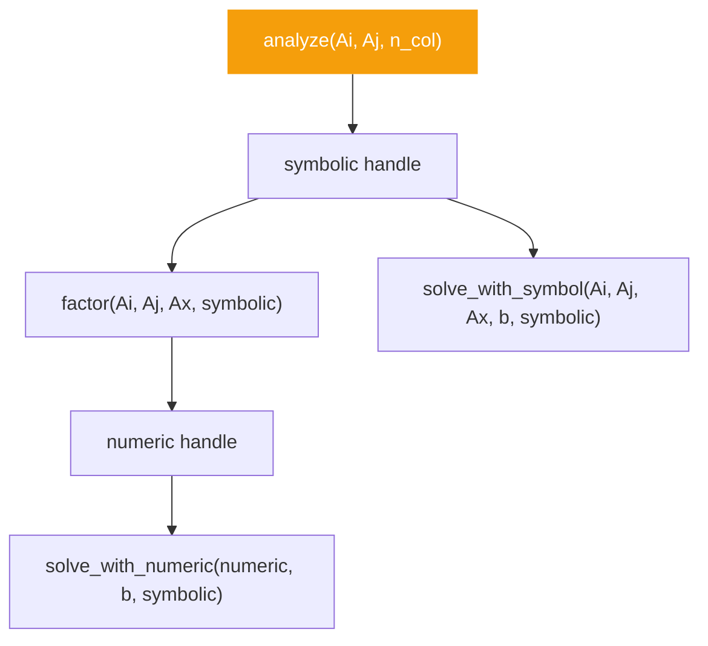

# analyze

```python
klujax.analyze(Ai, Aj, n_col) -> KLUHandleManager
```

Perform symbolic analysis on the sparsity pattern of a sparse matrix. This is the first (and most expensive) stage of the KLU algorithm. It studies **where** the nonzeros are (not their values) to find optimal orderings and block structures for the subsequent factorization.

## Parameters

| Parameter | Type  | Shape     | Description                          |
| --------- | ----- | --------- | ------------------------------------ |
| `Ai`      | int32 | `(n_nz,)` | Row indices of nonzero entries       |
| `Aj`      | int32 | `(n_nz,)` | Column indices of nonzero entries    |
| `n_col`   | int   | scalar    | Number of rows/columns in the matrix |

## Returns

| Type               | Description                                                     |
| ------------------ | --------------------------------------------------------------- |
| `KLUHandleManager` | A handle wrapping a C++ pointer to the symbolic analysis result |

## How It Fits In



The symbolic handle is used by:

- [factor](factor.md) — to compute LU decomposition
- [refactor](refactor.md) — to re-compute LU decomposition with new values
- [solve_with_symbol](solve-with-symbol.md) — to solve while skipping the analyze step
- [solve_with_numeric](solve-with-numeric.md) — also needs the symbolic handle

## Example

```python
import klujax
import jax.numpy as jnp

Ai = jnp.array([0, 1, 2], dtype=jnp.int32)
Aj = jnp.array([0, 1, 2], dtype=jnp.int32)
n_col = 3

# Analyze the sparsity pattern once
symbolic = klujax.analyze(Ai, Aj, n_col)

# Use it many times with different Ax and b values
for Ax_t, b_t in simulation_data:
    x = klujax.solve_with_symbol(Ai, Aj, Ax_t, b_t, symbolic)
```

## Memory Management

The returned `KLUHandleManager` wraps a C++ pointer. It cleans up automatically when garbage collected, but you can also manage it explicitly:

```python
# Option 1: Let Python handle it (recommended outside JIT)
symbolic = klujax.analyze(Ai, Aj, n_col)
# ... use it ...
# Freed when `symbolic` goes out of scope

# Option 2: Context manager
with klujax.analyze(Ai, Aj, n_col) as symbolic:
    x = klujax.solve_with_symbol(Ai, Aj, Ax, b, symbolic)
# Freed on exit

# Option 3: Explicit close
symbolic = klujax.analyze(Ai, Aj, n_col)
x = klujax.solve_with_symbol(Ai, Aj, Ax, b, symbolic)
symbolic.close()
```

!!! warning "Inside JIT"
If you call `analyze` inside a `jax.jit`-compiled function, the handle **will not** be freed automatically. You must call [free_symbolic](free.md) explicitly. See [Memory Management](../advanced/memory-management.md) for details.

!!! note "Not JIT-compiled itself"
`analyze` is a Python-side function — it runs eagerly on the CPU. Call it **outside** your JIT-compiled loops.
