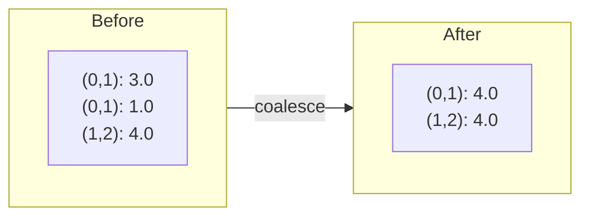

# coalesce

```python
klujax.coalesce(Ai, Aj, Ax) -> tuple[Array, Array, Array]
```

Sum duplicate entries in a COO sparse matrix. If multiple entries share the same (i, j) position, they are replaced by a single entry whose value is their sum.

## Parameters

| Parameter | Type                  | Shape                        | Description                             |
| --------- | --------------------- | ---------------------------- | --------------------------------------- |
| `Ai`      | int32                 | `(n_nz,)`                    | Row indices (may contain duplicates)    |
| `Aj`      | int32                 | `(n_nz,)`                    | Column indices (may contain duplicates) |
| `Ax`      | float64 or complex128 | `(n_nz,)` or `(n_lhs, n_nz)` | Values                                  |

## Returns

| Type           | Description                                                                   |
| -------------- | ----------------------------------------------------------------------------- |
| `(Ai, Aj, Ax)` | Deduplicated COO arrays. `n_nz` is reduced to the number of unique positions. |

## Why You Need This

klujax requires coalesced input — each (row, column) pair must appear at most once. If your data has duplicates (common when assembling finite element matrices), you must coalesce first.



## Example

```python
import klujax
import jax.numpy as jnp

# Two entries at position (0, 1)
Ai = jnp.array([0, 0, 1], dtype=jnp.int32)
Aj = jnp.array([0, 0, 1], dtype=jnp.int32)
Ax = jnp.array([2.0, 3.0, 4.0])

Ai, Aj, Ax = klujax.coalesce(Ai, Aj, Ax)
# Ai = [0, 1]
# Aj = [0, 1]
# Ax = [5.0, 4.0]  (2.0 + 3.0 = 5.0)
```

!!! warning "Not JIT-compatible"
    `coalesce` uses `jax.ensure_compile_time_eval()` internally and **cannot** be used inside `jax.jit`. Always call it before entering any JIT-compiled function.

## When Do Duplicates Appear?

Duplicates are common when:

- **Assembling finite element matrices** — each element contributes to shared nodes
- **Building matrices from edge lists** — edges may be listed multiple times
- **Merging sub-matrices** — combining sparse blocks can create overlapping entries
