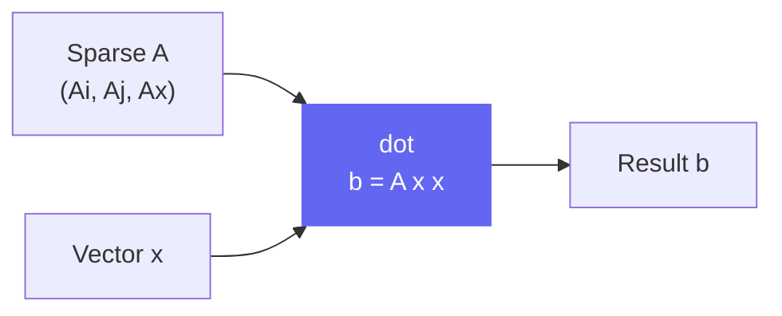

# dot

```python
klujax.dot(Ai, Aj, Ax, x) -> Array
```

Compute the sparse matrix-vector product **b = Ax**, where **A** is a sparse matrix in COO format. This is the opposite direction of `solve` — instead of finding x given b, it computes b given x.

## Parameters

| Parameter | Type                  | Shape                     | Description                       |
| --------- | --------------------- | ------------------------- | --------------------------------- |
| `Ai`      | int32                 | `(n_nz,)`                 | Row indices of nonzero entries    |
| `Aj`      | int32                 | `(n_nz,)`                 | Column indices of nonzero entries |
| `Ax`      | float64 or complex128 | `(n_lhs?, n_nz)`          | Values of nonzero entries         |
| `x`       | float64 or complex128 | `(n_lhs?, n_col, n_rhs?)` | Input vector(s)                   |

## Returns

| Type  | Shape             | Description            |
| ----- | ----------------- | ---------------------- |
| Array | Same shape as `x` | The product **b = Ax** |

## How It Works



For each nonzero entry at position (i, j) with value v, `dot` adds `v * x[j]` to `b[i]`. It's a straightforward sparse multiply — no factorization needed.

## JAX Features

| Feature      | Supported                 |
| ------------ | ------------------------- |
| `jax.jit`    | Yes (auto-wrapped)        |
| `jax.grad`   | Yes (w.r.t. `Ax` and `x`) |
| `jax.jacfwd` | Yes                       |
| `jax.jacrev` | Yes                       |
| `jax.vmap`   | Yes                       |

## Example

```python
import klujax
import jax.numpy as jnp

# 3x3 diagonal matrix: diag(2, 3, 4)
Ai = jnp.array([0, 1, 2], dtype=jnp.int32)
Aj = jnp.array([0, 1, 2], dtype=jnp.int32)
Ax = jnp.array([2.0, 3.0, 4.0])

x = jnp.array([1.0, 2.0, 3.0])
b = klujax.dot(Ai, Aj, Ax, x)
# b = [2.0, 6.0, 12.0]
```

## Relationship to solve

`solve` and `dot` are inverses of each other:


```python
b = klujax.dot(Ai, Aj, Ax, x)
x_recovered = klujax.solve(Ai, Aj, Ax, b)
# x_recovered ≈ x (up to floating point precision)
```

## Shape Inference

Same rules as [solve](solve.md#shape-inference) — `Ax` and `x` dimensions are automatically expanded.
