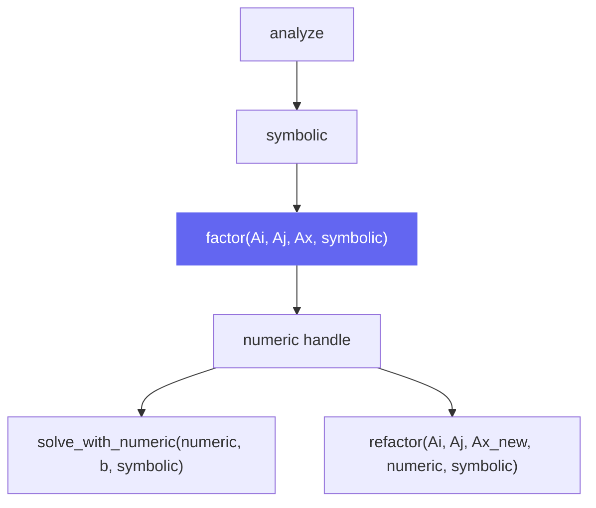
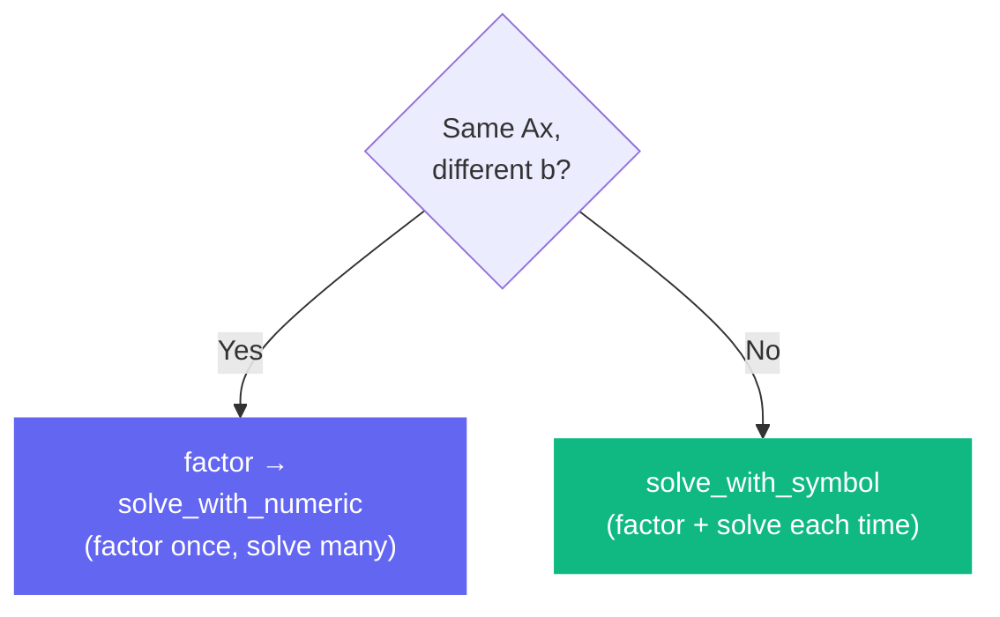

# factor

```python
klujax.factor(Ai, Aj, Ax, symbolic) -> KLUHandleManager
```

Perform numeric LU factorization using a pre-computed symbolic analysis. This computes **A = LU** (lower × upper triangular decomposition) using the actual matrix values, given the structural information from [analyze](analyze.md).

## Parameters

| Parameter | Type | Shape | Description |
|-----------|------|-------|-------------|
| `Ai` | int32 | `(n_nz,)` | Row indices |
| `Aj` | int32 | `(n_nz,)` | Column indices |
| `Ax` | float64 or complex128 | `(n_lhs?, n_nz)` | Matrix values |
| `symbolic` | KLUHandleManager | — | Handle from [analyze](analyze.md) |

## Returns

| Type | Description |
|------|-------------|
| `KLUHandleManager` | A handle wrapping the numeric LU factorization |

## How It Fits In



## Example

```python
import klujax
import jax.numpy as jnp

Ai = jnp.array([0, 1, 2], dtype=jnp.int32)
Aj = jnp.array([0, 1, 2], dtype=jnp.int32)
Ax = jnp.array([2.0, 3.0, 4.0])
n_col = 3

# Step 1: Analyze pattern
symbolic = klujax.analyze(Ai, Aj, n_col)

# Step 2: Factor with specific values
numeric = klujax.factor(Ai, Aj, Ax, symbolic)

# Step 3: Solve many b's with the same factorization
for b_t in right_hand_sides:
    x = klujax.solve_with_numeric(numeric, b_t, symbolic)
```

## Batched Factorization

If `Ax` has shape `(n_lhs, n_nz)`, `factor` creates one numeric factorization per batch element:

```python
# 5 different matrices, same sparsity pattern
Ax_batch = jnp.ones((5, 3)) * jnp.arange(1, 6)[:, None]

numeric = klujax.factor(Ai, Aj, Ax_batch, symbolic)
# numeric wraps 5 separate LU factorizations
```

## Memory Management

Same rules as [analyze](analyze.md#memory-management) — the handle cleans up automatically outside JIT, but needs explicit [free_numeric](free.md) inside JIT.

## When to Use factor vs. solve_with_symbol

- Use **factor** when you need to solve the same matrix against many different `b` vectors. Factor once, solve many times.
- Use **solve_with_symbol** when both `Ax` and `b` change together — it factors and solves in one step.


