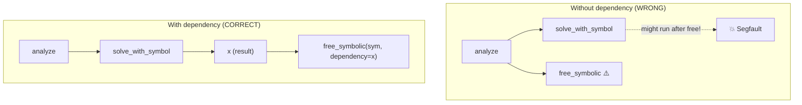

# free_symbolic / free_numeric

```python
klujax.free_symbolic(symbolic, dependency=None) -> None
klujax.free_numeric(numeric, dependency=None) -> None
```

Explicitly free the C++ memory behind a KLU handle. You only need these inside `jax.jit`-compiled functions — outside JIT, handles are freed automatically.

## Parameters

### free_symbolic

| Parameter | Type | Description |
|-----------|------|-------------|
| `symbolic` | KLUHandleManager | Handle from [analyze](../api/analyze.md) |
| `dependency` | Array or None | An array that must be computed **before** the handle is freed |

### free_numeric

| Parameter | Type | Description |
|-----------|------|-------------|
| `numeric` | KLUHandleManager | Handle from [factor](../api/factor.md) or [refactor](../api/refactor.md) |
| `dependency` | Array or None | An array that must be computed **before** the handle is freed |

## Why dependency Matters

Inside JIT, the XLA compiler can reorder operations. Without a dependency, the compiler might free your handle **before** the solve that uses it has finished. The `dependency` parameter tells XLA: "don't free this until the dependency array is ready."



## Example: Inside JIT

```python
@jax.jit
def dynamic_solve(Ai, Aj, Ax, b):
    # Create handle inside JIT (not ideal, but sometimes necessary)
    sym = klujax.analyze(Ai, Aj, 5)

    # Solve
    x = klujax.solve_with_symbol(Ai, Aj, Ax, b, sym)

    # CRITICAL: Free with dependency to ensure correct ordering
    klujax.free_symbolic(sym, dependency=x)

    return x
```

## When You Don't Need These

Outside JIT, handles clean up automatically:

```python
# This is fine — no need to call free_symbolic
symbolic = klujax.analyze(Ai, Aj, n_col)
x = klujax.solve_with_symbol(Ai, Aj, Ax, b, symbolic)
# symbolic is freed when garbage collected
```

Or use a context manager:

```python
with klujax.analyze(Ai, Aj, n_col) as symbolic:
    x = klujax.solve_with_symbol(Ai, Aj, Ax, b, symbolic)
# Freed here
```

!!! tip
    The best practice is to create handles **outside** JIT. Then you never need `free_symbolic` or `free_numeric` at all. See [Memory Management](../advanced/memory-management.md).
