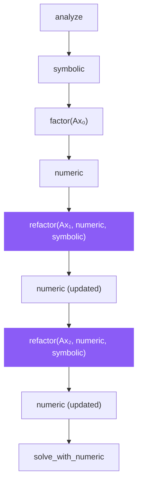

# refactor

```python
klujax.refactor(Ai, Aj, Ax, numeric, symbolic) -> KLUHandleManager
```

Re-compute the LU factorization with new matrix values, reusing both the symbolic analysis and the existing numeric handle's memory. This is faster than calling [factor](factor.md) again because it updates the factorization in-place.

## Parameters

| Parameter  | Type                  | Shape            | Description                                                       |
| ---------- | --------------------- | ---------------- | ----------------------------------------------------------------- |
| `Ai`       | int32                 | `(n_nz,)`        | Row indices                                                       |
| `Aj`       | int32                 | `(n_nz,)`        | Column indices                                                    |
| `Ax`       | float64 or complex128 | `(n_lhs?, n_nz)` | **New** matrix values                                             |
| `numeric`  | KLUHandleManager      | —                | Existing handle from [factor](factor.md) or a previous `refactor` |
| `symbolic` | KLUHandleManager      | —                | Handle from [analyze](analyze.md)                                 |

## Returns

| Type               | Description                                                          |
| ------------------ | -------------------------------------------------------------------- |
| `KLUHandleManager` | The same numeric handle, updated in-place with the new factorization |

## How It Fits In



## Example: Simulation Loop

```python
import jax
import klujax
import jax.numpy as jnp

Ai = jnp.array([0, 1, 2], dtype=jnp.int32)
Aj = jnp.array([0, 1, 2], dtype=jnp.int32)
n_col = 3

# Setup
symbolic = klujax.analyze(Ai, Aj, n_col)
numeric = klujax.factor(Ai, Aj, Ax_initial, symbolic)

# Simulation loop — matrix values change each step
for t in range(num_steps):
    Ax_t = compute_new_matrix_values(t)
    numeric = klujax.refactor(Ai, Aj, Ax_t, numeric, symbolic)
    x_t = klujax.solve_with_numeric(numeric, b_t, symbolic)
```

## factor vs. refactor

|                         | factor              | refactor           |
| ----------------------- | ------------------- | ------------------ |
| Needs existing numeric? | No                  | Yes                |
| Allocates new memory?   | Yes                 | No (in-place)      |
| Speed                   | Moderate            | Slightly faster    |
| Use case                | First factorization | Subsequent updates |

`refactor` is most useful in time-stepping simulations where the matrix values change at every step but the sparsity pattern stays the same.

## JAX Features

| Feature    | Supported                      |
| ---------- | ------------------------------ |
| `jax.jit`  | Yes (via internal JIT wrapper) |
| `jax.grad` | Yes (w.r.t. `Ax`)              |
| `jax.vmap` | Yes                            |
| `jax.pmap` | Yes                            |
