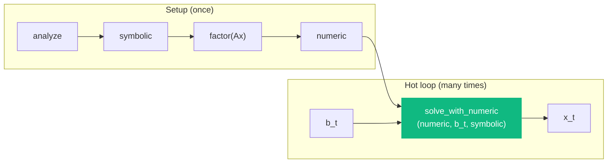
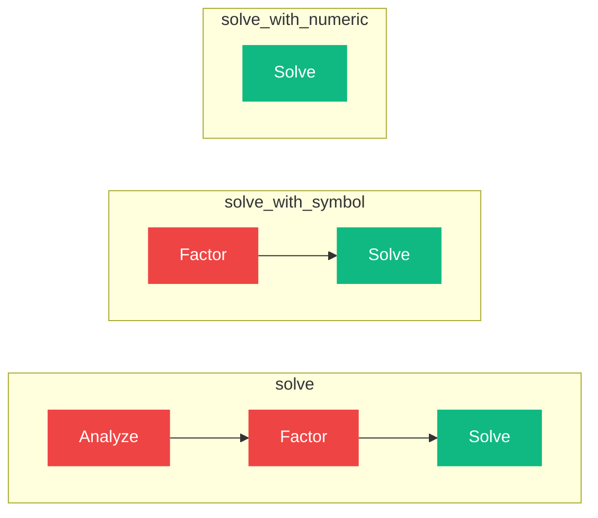

# solve_with_numeric

```python
klujax.solve_with_numeric(numeric, b, symbolic) -> Array
```

Solve **Ax = b** using a pre-computed numeric factorization. This is the fastest solve path — it skips both the analyze and factor steps, and only performs forward/backward substitution.

## Parameters

| Parameter | Type | Shape | Description |
|-----------|------|-------|-------------|
| `numeric` | KLUHandleManager | — | Handle from [factor](factor.md) or [refactor](refactor.md) |
| `b` | float64 or complex128 | `(n_lhs?, n_col, n_rhs?)` | Right-hand side |
| `symbolic` | KLUHandleManager | — | Handle from [analyze](analyze.md) |

## Returns

| Type | Shape | Description |
|------|-------|-------------|
| Array | Same shape as `b` | The solution **x** |

## How It Fits In



## Example

```python
import jax
import klujax
import jax.numpy as jnp

Ai = jnp.array([0, 1, 2], dtype=jnp.int32)
Aj = jnp.array([0, 1, 2], dtype=jnp.int32)
Ax = jnp.array([2.0, 3.0, 4.0])
n_col = 3

# Setup: analyze + factor (done once)
symbolic = klujax.analyze(Ai, Aj, n_col)
numeric = klujax.factor(Ai, Aj, Ax, symbolic)

# Hot loop: only substitution (very fast)
@jax.jit
def fast_solve(b, num, sym):
    return klujax.solve_with_numeric(num, b, sym)

for i in range(10_000):
    x = fast_solve(b_values[i], numeric, symbolic)
```

## Performance Comparison



This is the fastest option. Only forward/backward substitution is performed — no pattern analysis, no LU decomposition. Use this when the matrix A stays constant and only b changes.

## Batched Solve

If `numeric` was created from batched `Ax` (shape `(n_lhs, n_nz)`), you can solve all batches at once:

```python
# numeric wraps 5 factorizations
Ax_batch = jnp.ones((5, 3)) * jnp.arange(1, 6)[:, None]
numeric = klujax.factor(Ai, Aj, Ax_batch, symbolic)

# Solve all 5 systems
b_batch = jnp.ones((5, 3))
x_batch = klujax.solve_with_numeric(numeric, b_batch, symbolic)
```

You can also broadcast: a single `numeric` (from 1D `Ax`) can solve against batched `b`:

```python
numeric = klujax.factor(Ai, Aj, Ax, symbolic)  # single factorization
b_batch = jnp.ones((10, 3, 2))  # 10 batches, 2 right-hand sides each
x_batch = klujax.solve_with_numeric(numeric, b_batch, symbolic)
```

## JAX Features

| Feature | Supported |
|---------|-----------|
| `jax.jit` | Yes |
| `jax.vmap` | Yes |
