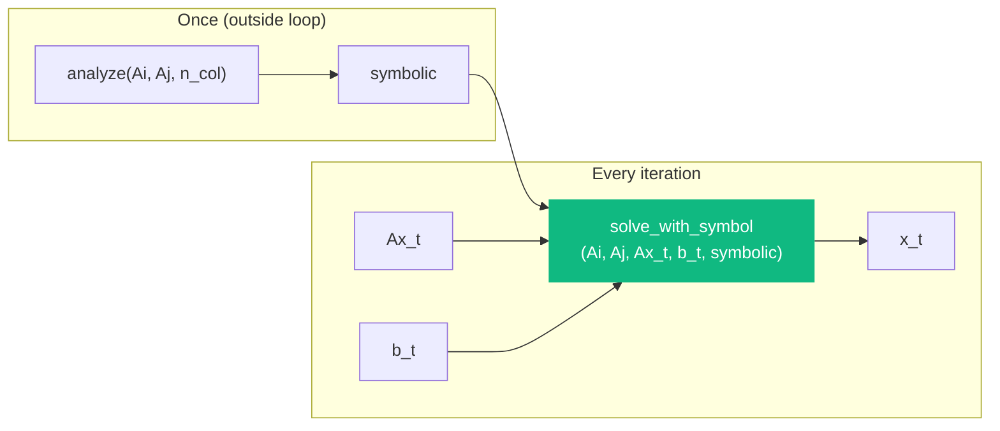
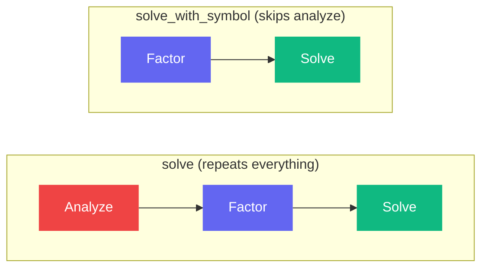

# solve_with_symbol

```python
klujax.solve_with_symbol(Ai, Aj, Ax, b, symbolic) -> Array
```

Solve **Ax = b** using a pre-computed symbolic analysis. This skips the expensive analyze step and only performs factorization + solve. Use this when the sparsity pattern is constant but the values and right-hand side change.

## Parameters

| Parameter  | Type                  | Shape                     | Description                       |
| ---------- | --------------------- | ------------------------- | --------------------------------- |
| `Ai`       | int32                 | `(n_nz,)`                 | Row indices                       |
| `Aj`       | int32                 | `(n_nz,)`                 | Column indices                    |
| `Ax`       | float64 or complex128 | `(n_lhs?, n_nz)`          | Matrix values                     |
| `b`        | float64 or complex128 | `(n_lhs?, n_col, n_rhs?)` | Right-hand side                   |
| `symbolic` | KLUHandleManager      | —                         | Handle from [analyze](analyze.md) |

## Returns

| Type  | Shape             | Description        |
| ----- | ----------------- | ------------------ |
| Array | Same shape as `b` | The solution **x** |

## How It Fits In



## Example

```python
import jax
import klujax
import jax.numpy as jnp

Ai = jnp.array([0, 0, 1, 1, 2, 2], dtype=jnp.int32)
Aj = jnp.array([0, 1, 0, 1, 1, 2], dtype=jnp.int32)
n_col = 3

# Expensive analysis — done once
symbolic = klujax.analyze(Ai, Aj, n_col)

# Fast JIT-compiled solve — done many times
@jax.jit
def step(Ax, b, sym):
    return klujax.solve_with_symbol(Ai, Aj, Ax, b, sym)

for t in range(1000):
    x_t = step(Ax_values[t], b_values[t], symbolic)
```

## Performance Comparison



The analyze step is typically the most expensive part. Skipping it can give substantial speedups when solving many systems with the same sparsity pattern.

## JAX Features

| Feature      | Supported                 |
| ------------ | ------------------------- |
| `jax.jit`    | Yes                       |
| `jax.grad`   | Yes (w.r.t. `Ax` and `b`) |
| `jax.jacfwd` | Yes                       |
| `jax.vmap`   | Yes                       |
