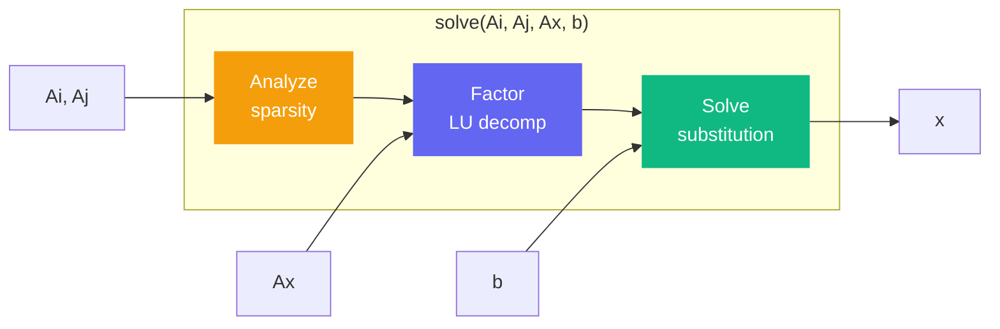

# solve

```python
klujax.solve(Ai, Aj, Ax, b) -> Array
```

Solve for **x** in the sparse linear system **Ax = b**. This is the main entry point — it runs the full KLU pipeline (analyze, factor, solve) in one call.

## Parameters

| Parameter | Type                  | Shape                     | Description                       |
| --------- | --------------------- | ------------------------- | --------------------------------- |
| `Ai`      | int32                 | `(n_nz,)`                 | Row indices of nonzero entries    |
| `Aj`      | int32                 | `(n_nz,)`                 | Column indices of nonzero entries |
| `Ax`      | float64 or complex128 | `(n_lhs?, n_nz)`          | Values of nonzero entries         |
| `b`       | float64 or complex128 | `(n_lhs?, n_col, n_rhs?)` | Right-hand side vector(s)         |

## Returns

| Type  | Shape             | Description                             |
| ----- | ----------------- | --------------------------------------- |
| Array | Same shape as `b` | The solution **x** such that **Ax = b** |

## How It Works



Every call to `solve` performs all three KLU stages. This is convenient but not optimal when you're solving many systems with the same sparsity pattern — see [analyze](analyze.md) and [solve_with_symbol](solve-with-symbol.md) for the split API.

## JAX Features

| Feature      | Supported                 |
| ------------ | ------------------------- |
| `jax.jit`    | Yes (auto-wrapped)        |
| `jax.grad`   | Yes (w.r.t. `Ax` and `b`) |
| `jax.jacfwd` | Yes                       |
| `jax.jacrev` | Yes                       |
| `jax.vmap`   | Yes                       |

!!! warning
Gradients with respect to `Ai` and `Aj` (the indices) are **not** supported — indices are integers and not differentiable.

## Examples

### Basic

```python
import klujax
import jax.numpy as jnp

Ai = jnp.array([0, 1, 2], dtype=jnp.int32)
Aj = jnp.array([0, 1, 2], dtype=jnp.int32)
Ax = jnp.array([2.0, 3.0, 4.0])
b = jnp.array([6.0, 9.0, 12.0])

x = klujax.solve(Ai, Aj, Ax, b)
# x = [3.0, 3.0, 3.0]
```

### Batched (Multiple Systems)

```python
# 3 different matrices, same sparsity pattern
Ax = jnp.array([
    [2.0, 3.0, 4.0],
    [1.0, 1.0, 1.0],
    [4.0, 6.0, 8.0],
])  # shape: (3, 3)

b = jnp.array([
    [6.0, 9.0, 12.0],
    [1.0, 1.0, 1.0],
    [12.0, 18.0, 24.0],
])  # shape: (3, 3)

x = klujax.solve(Ai, Aj, Ax, b)
# Solves all 3 systems at once
```

### Complex

```python
Ax = jnp.array([2.0 + 1j, 3.0 - 1j, 4.0 + 0j])
b = jnp.array([6.0 + 3j, 9.0 - 3j, 12.0 + 0j])

x = klujax.solve(Ai, Aj, Ax, b)
```

## Shape Inference

`solve` automatically expands underdefined dimensions:

| Ax dims | b dims | Ax is treated as | b is treated as         |
| ------- | ------ | ---------------- | ----------------------- |
| 1D      | 1D     | `(n_nz,)`        | `(n_col,)`              |
| 1D      | 2D     | `(n_nz,)`        | `(n_col, n_rhs)`        |
| 1D      | 3D     | `(n_nz,)`        | `(n_lhs, n_col, n_rhs)` |
| 2D      | 1D     | `(n_lhs, n_nz)`  | `(n_col,)`              |
| 2D      | 2D     | `(n_lhs, n_nz)`  | `(n_lhs, n_col)`        |
| 2D      | 3D     | `(n_lhs, n_nz)`  | `(n_lhs, n_col, n_rhs)` |

## When to Use Something Else

- Solving **many times** with the same sparsity pattern? Use [analyze](analyze.md) + [solve_with_symbol](solve-with-symbol.md).
- Solving **many times** with the same matrix values? Use [factor](factor.md) + [solve_with_numeric](solve-with-numeric.md).
- Need **matrix-vector product** (not solve)? Use [dot](dot.md).
