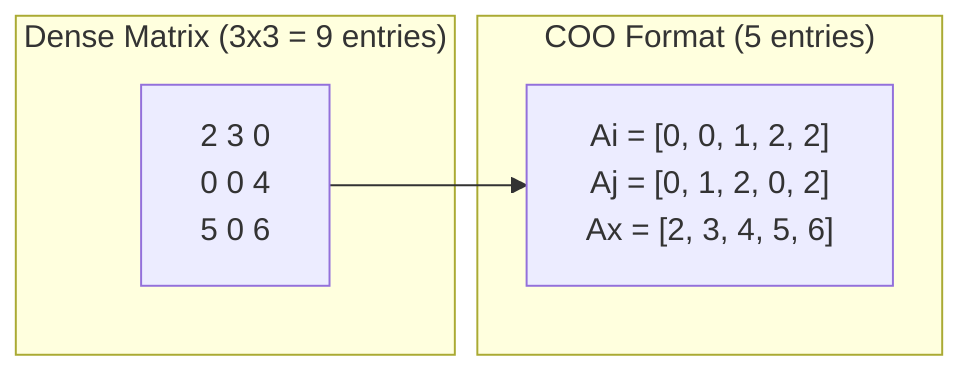
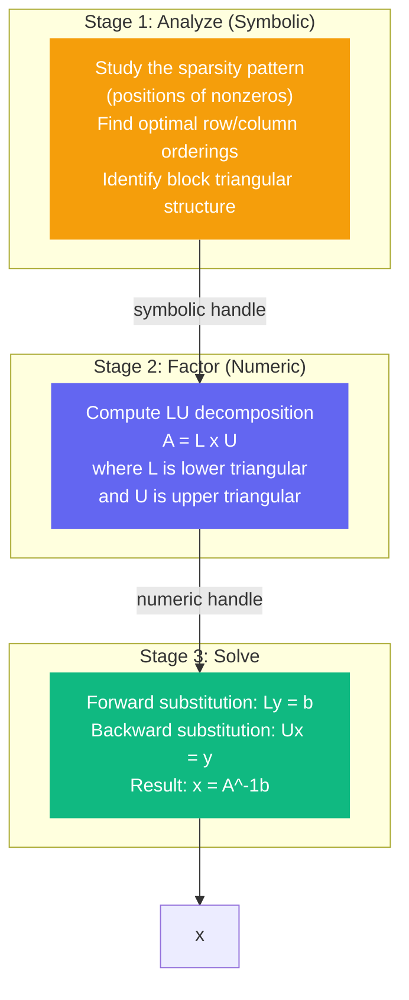

# Core Concepts

## What is a Sparse Matrix?

A sparse matrix is a matrix where most entries are zero. Instead of storing every single entry (including all those zeros), we only store the nonzero values and their positions. This saves enormous amounts of memory and computation.

**Example:** a 1000×1000 matrix with only 5000 nonzero entries stores 5000 values instead of 1,000,000.

## COO Format (Coordinate Format)

klujax uses **COO format** to represent sparse matrices. COO stores three arrays:

| Array | Type                  | Shape                        | Description                        |
| ----- | --------------------- | ---------------------------- | ---------------------------------- |
| `Ai`  | int32                 | `(n_nz,)`                    | Row index of each nonzero entry    |
| `Aj`  | int32                 | `(n_nz,)`                    | Column index of each nonzero entry |
| `Ax`  | float64 or complex128 | `(n_nz,)` or `(n_lhs, n_nz)` | Value of each nonzero entry        |

Here, `n_nz` is the number of nonzero entries.

**Example:** the matrix

```
[2  3  0]
[0  0  4]
[5  0  6]
```

is stored as:

```python
Ai = [0, 0, 1, 2, 2]  # rows
Aj = [0, 1, 2, 0, 2]  # columns
Ax = [2, 3, 4, 5, 6]  # values
```



## Coalescing

If your COO arrays have **duplicate** (i, j) pairs — meaning two entries at the same position — you must **coalesce** them before passing to klujax. Coalescing sums up duplicate entries.

```python
# Before coalescing: two entries at position (0, 1)
Ai = jnp.array([0, 0, 0])
Aj = jnp.array([0, 1, 1])
Ax = jnp.array([2.0, 3.0, 1.0])

# After coalescing: the two (0,1) entries are summed
Ai, Aj, Ax = klujax.coalesce(Ai, Aj, Ax)
# Ai = [0, 0], Aj = [0, 1], Ax = [2.0, 4.0]
```

!!! warning
`coalesce` cannot be used inside `jax.jit`. Call it before entering any JIT-compiled function.

## The KLU Algorithm

KLU is a solver for sparse linear systems **Ax = b**. It works in three stages:



### Why Three Stages?

Each stage depends on different inputs and has different computational cost:

| Stage       | Depends On                | Cost      | When to Rerun                 |
| ----------- | ------------------------- | --------- | ----------------------------- |
| **Analyze** | Sparsity pattern (Ai, Aj) | Expensive | Only when the pattern changes |
| **Factor**  | Matrix values (Ax)        | Moderate  | When Ax changes               |
| **Solve**   | Right-hand side (b)       | Cheap     | Every time b changes          |

This separation is the key to high performance. If your sparsity pattern stays the same across many solves (common in simulations), you analyze once and reuse the result thousands of times.

## Shapes and Batching

klujax supports flexible shapes so you can solve many systems at once without loops.

### Dimension Names

| Name    | Meaning                                          |
| ------- | ------------------------------------------------ |
| `n_nz`  | Number of nonzero entries in A                   |
| `n_col` | Number of rows/columns in A (A is always square) |
| `n_lhs` | Batch dimension — number of different A matrices |
| `n_rhs` | Number of right-hand sides per system            |

### Shape Combinations

klujax automatically interprets your input shapes:

| Ax shape        | b shape                 | Interpretation                              |
| --------------- | ----------------------- | ------------------------------------------- |
| `(n_nz,)`       | `(n_col,)`              | One system, one right-hand side             |
| `(n_nz,)`       | `(n_col, n_rhs)`        | One system, multiple right-hand sides       |
| `(n_lhs, n_nz)` | `(n_col,)`              | Multiple systems, same right-hand side      |
| `(n_lhs, n_nz)` | `(n_lhs, n_col)`        | Multiple systems, one right-hand side each  |
| `(n_lhs, n_nz)` | `(n_lhs, n_col, n_rhs)` | Multiple systems, multiple right-hand sides |

The `n_lhs` batch dimension is shared — if Ax has 10 batches, b must also have 10 (or just 1, which broadcasts).

### Going Beyond 3D

Need more batch dimensions? Use `jax.vmap`:

```python
# 4D: vmap adds an outer batch over the n_lhs batch
x_4d = jax.vmap(klujax.solve, in_axes=(None, None, 0, 0))(Ai, Aj, Ax_4d, b_4d)
```

## Data Types

klujax only supports double precision:

| Input Type   | Auto-cast To           |
| ------------ | ---------------------- |
| `float32`    | `float64`              |
| `float64`    | `float64` (no cast)    |
| `complex64`  | `complex128`           |
| `complex128` | `complex128` (no cast) |

If either `Ax` or `b` is complex, the entire solve uses complex arithmetic.

!!! note
klujax automatically enables `jax_enable_x64` when imported. You don't need to configure this yourself.
