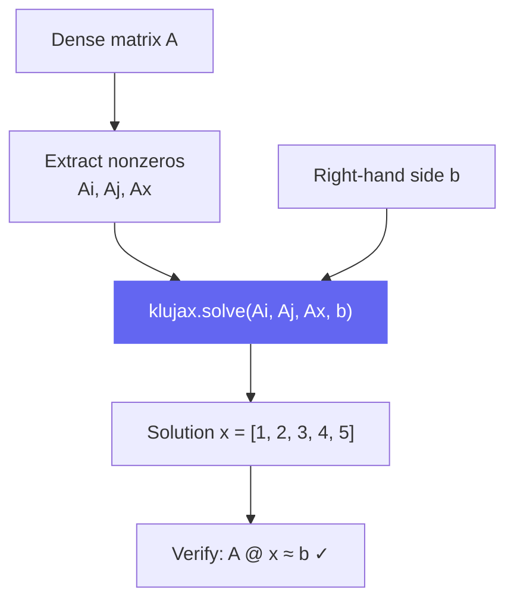

# Basic Solve

This example walks through solving a sparse linear system step by step.

## The Problem

We have a 5×5 matrix and want to solve **Ax = b**:

```
A = [2   3   0   0   0]      b = [ 8]      x = [?]
    [3   0   4   0   6]          [45]          [?]
    [0  -1  -3   2   0]          [-3]          [?]
    [0   0   1   0   0]          [ 3]          [?]
    [0   4   2   0   1]          [19]          [?]
```

## Step 1: Convert to COO

First, identify the nonzero entries and their positions:

```python
import jax.numpy as jnp

# Row and column indices of each nonzero entry
Ai = jnp.array([0, 0, 1, 1, 1, 2, 2, 2, 3, 4, 4, 4], dtype=jnp.int32)
Aj = jnp.array([0, 1, 0, 2, 4, 1, 2, 3, 2, 1, 2, 4], dtype=jnp.int32)
Ax = jnp.array([2, 3, 3, 4, 6, -1, -3, 2, 1, 4, 2, 1], dtype=jnp.float64)

b = jnp.array([8.0, 45.0, -3.0, 3.0, 19.0])
```

!!! tip "Quick conversion from dense"
    If you already have a dense matrix, convert it like this:
    ```python
    A_dense = jnp.array([[2, 3, 0, 0, 0], ...])
    Ai, Aj = jnp.where(jnp.abs(A_dense) > 0)
    Ax = A_dense[Ai, Aj]
    ```

## Step 2: Solve

```python
import klujax

x = klujax.solve(Ai, Aj, Ax, b)
print(x)
# [1. 2. 3. 4. 5.]
```

## Step 3: Verify

```python
# Reconstruct dense A and verify
A_dense = jnp.zeros((5, 5)).at[Ai, Aj].set(Ax)
x_ref = jnp.linalg.solve(A_dense, b)

print(jnp.allclose(x, x_ref))  # True
```

## The Flow



## Using dot to Check

You can also verify with `klujax.dot`:

```python
b_check = klujax.dot(Ai, Aj, Ax, x)
print(jnp.allclose(b_check, b))  # True
```

## Complex Numbers

The exact same code works with complex matrices:

```python
Ax_complex = Ax.astype(jnp.complex128) + 1j * jnp.ones_like(Ax)
b_complex = b.astype(jnp.complex128) + 2j * jnp.ones(5)

x_complex = klujax.solve(Ai, Aj, Ax_complex, b_complex)
```

## With Coalescing

If your COO data has duplicate entries (same row and column), coalesce first:

```python
# Duplicate entry at (0, 0): values 1.0 and 1.0
Ai_dup = jnp.array([0, 0, 0, 1, 2], dtype=jnp.int32)
Aj_dup = jnp.array([0, 0, 1, 1, 2], dtype=jnp.int32)
Ax_dup = jnp.array([1.0, 1.0, 3.0, 3.0, 4.0])

# Coalesce: sums the duplicate (0,0) entries → 2.0
Ai_c, Aj_c, Ax_c = klujax.coalesce(Ai_dup, Aj_dup, Ax_dup)

x = klujax.solve(Ai_c, Aj_c, Ax_c, b[:3])
```
