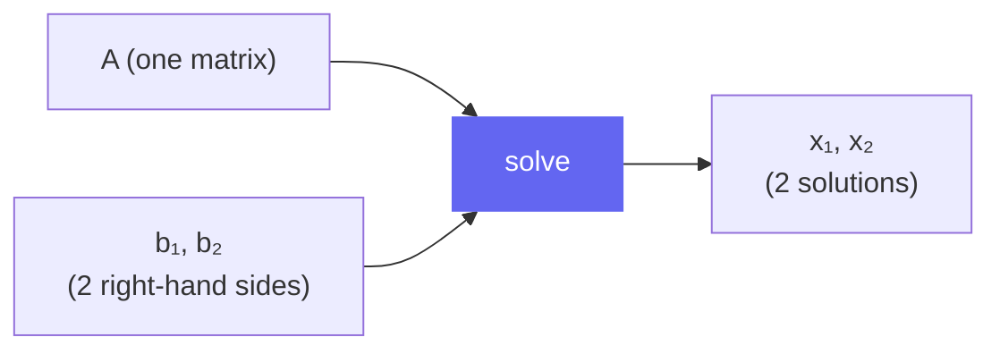
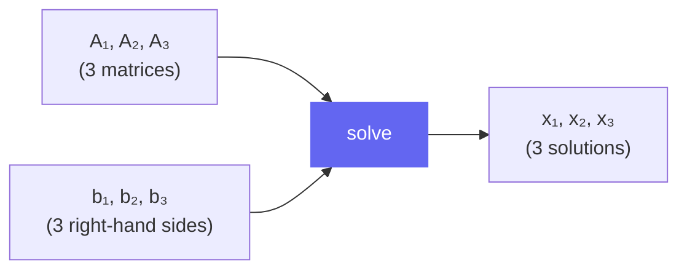

# Batched Systems

klujax can solve many linear systems simultaneously. This is useful when you have multiple matrices sharing the same sparsity pattern, or multiple right-hand sides for the same matrix.

## Multiple Right-Hand Sides

Solve **Ax₁ = b₁** and **Ax₂ = b₂** with the same A:

```python
import klujax
import jax.numpy as jnp

Ai = jnp.array([0, 1, 2], dtype=jnp.int32)
Aj = jnp.array([0, 1, 2], dtype=jnp.int32)
Ax = jnp.array([2.0, 3.0, 4.0])

# b has shape (3, 2) — 3 rows, 2 right-hand sides
b = jnp.array([
    [6.0, 10.0],
    [9.0, 15.0],
    [12.0, 20.0],
])

x = klujax.solve(Ai, Aj, Ax, b)
# x[:, 0] = [3, 3, 3]  (solution for b₁)
# x[:, 1] = [5, 5, 5]  (solution for b₂)
```



## Multiple Matrices (Batched Ax)

Solve different matrices (same pattern, different values) against different right-hand sides:

```python
# 3 different diagonal matrices
Ax = jnp.array([
    [2.0, 3.0, 4.0],  # diag(2, 3, 4)
    [1.0, 1.0, 1.0],  # identity
    [4.0, 6.0, 8.0],  # diag(4, 6, 8)
])

# 3 corresponding right-hand sides
b = jnp.array([
    [6.0, 9.0, 12.0],
    [5.0, 5.0, 5.0],
    [8.0, 12.0, 16.0],
])

x = klujax.solve(Ai, Aj, Ax, b)
# x[0] = [3, 3, 3]
# x[1] = [5, 5, 5]
# x[2] = [2, 2, 2]
```



## Broadcasting: One Matrix, Many b's

When Ax is 2D (batched) but b is 1D, the same b is used for all matrices:

```python
Ax = jnp.array([
    [2.0, 3.0, 4.0],
    [1.0, 1.0, 1.0],
])
b = jnp.array([6.0, 9.0, 12.0])  # same b for both

x = klujax.solve(Ai, Aj, Ax, b)
# x[0] = [3, 3, 3]   (solved with Ax[0])
# x[1] = [6, 9, 12]  (solved with Ax[1] = identity)
```

## Using vmap for Extra Dimensions

For dimensions beyond what the built-in batching supports, use `jax.vmap`:

```python
import jax

# 4D: outer batch of 5, inner batch of 3
Ax_4d = jnp.ones((5, 3, 3))  # (5, n_lhs=3, n_nz=3)
b_4d = jnp.ones((5, 3, 3))   # (5, n_lhs=3, n_col=3)

# vmap over the outer dimension
x_4d = jax.vmap(klujax.solve, in_axes=(None, None, 0, 0))(Ai, Aj, Ax_4d, b_4d)
```

### vmap Axis Options

```python
# Batch over Ax only (same b for all)
x = jax.vmap(klujax.solve, in_axes=(None, None, 0, None))(Ai, Aj, Ax_batch, b)

# Batch over b only (same matrix for all)
x = jax.vmap(klujax.solve, in_axes=(None, None, None, 0))(Ai, Aj, Ax, b_batch)

# Batch over both
x = jax.vmap(klujax.solve, in_axes=(None, None, 0, 0))(Ai, Aj, Ax_batch, b_batch)
```

!!! note
    `Ai` and `Aj` are **never** batched — all systems share the same sparsity pattern. Always use `in_axes=None` for the index arrays.

## Complete Example: Parameter Sweep

```python
import jax
import klujax
import jax.numpy as jnp

# Base matrix pattern
Ai = jnp.array([0, 0, 1, 1, 2, 2], dtype=jnp.int32)
Aj = jnp.array([0, 1, 0, 1, 1, 2], dtype=jnp.int32)
base_Ax = jnp.array([4.0, -1.0, -1.0, 4.0, -1.0, 4.0])

# Sweep over 100 scaling factors
scales = jnp.linspace(0.5, 2.0, 100)
Ax_sweep = scales[:, None] * base_Ax[None, :]  # (100, 6)

b = jnp.array([1.0, 0.0, 0.0])

# Solve all 100 systems at once
x_all = klujax.solve(Ai, Aj, Ax_sweep, b)
# x_all has shape (100, 3)
```
