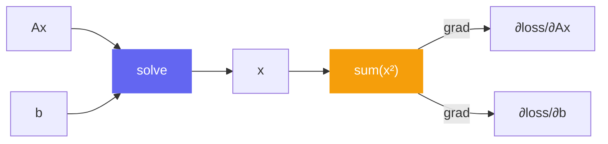

# Differentiation

klujax supports automatic differentiation through all its operations. This means you can compute gradients of losses that involve sparse linear solves — essential for optimization, inverse problems, and machine learning.

## Gradient of a Scalar Loss

```python
import jax
import klujax
import jax.numpy as jnp

Ai = jnp.array([0, 0, 1, 1, 2, 2], dtype=jnp.int32)
Aj = jnp.array([0, 1, 0, 1, 1, 2], dtype=jnp.int32)
Ax = jnp.array([4.0, -1.0, -1.0, 4.0, -1.0, 4.0])
b = jnp.array([1.0, 0.0, 0.0])

def loss(Ax, b):
    x = klujax.solve(Ai, Aj, Ax, b)
    return jnp.sum(x ** 2)

# Gradient w.r.t. both Ax and b
grad_Ax, grad_b = jax.grad(loss, argnums=(0, 1))(Ax, b)
```



## How Gradients Work

### Forward Mode (JVP)

For **x = A⁻¹b**, the forward-mode derivative (Jacobian-vector product) is:

**dx = A⁻¹(db - dA · x)**

In words: perturb b by db and A by dA, then solve one more linear system to get the change in x.

### Reverse Mode (VJP / Backpropagation)

For reverse mode, klujax computes:

- **Gradient w.r.t. b**: solve **A^T · g = cotangent** (transpose solve)
- **Gradient w.r.t. Ax**: compute from the cotangent and the solution x

## Forward Jacobian (jacfwd)

Compute the full Jacobian of the solution with respect to matrix values:

```python
# Jacobian of x w.r.t. Ax
# Shape: (n_col, n_nz) — how each x[i] changes with each Ax[j]
J_Ax = jax.jacfwd(lambda ax: klujax.solve(Ai, Aj, ax, b))(Ax)

# Jacobian of x w.r.t. b
# Shape: (n_col, n_col) — how each x[i] changes with each b[j]
J_b = jax.jacfwd(lambda bb: klujax.solve(Ai, Aj, Ax, bb))(b)
```

## Reverse Jacobian (jacrev)

Same Jacobians, computed via reverse mode (more efficient when output is smaller than input):

```python
J_Ax = jax.jacrev(lambda ax: klujax.solve(Ai, Aj, ax, b))(Ax)
J_b = jax.jacrev(lambda bb: klujax.solve(Ai, Aj, Ax, bb))(b)
```

## Differentiating dot

`klujax.dot` is also differentiable:

```python
def dot_loss(Ax, x):
    b = klujax.dot(Ai, Aj, Ax, x)
    return jnp.sum(b ** 2)

grad_Ax, grad_x = jax.grad(dot_loss, argnums=(0, 1))(Ax, x)
```

For **b = Ax**, the derivatives are straightforward:

- **∂b/∂x**: the matrix A itself (sparse multiply with cotangent)
- **∂b/∂Ax**: involves the input vector x at the nonzero positions

## What You Can Differentiate

| Function | w.r.t. Ax | w.r.t. b/x | w.r.t. Ai, Aj |
|----------|----------|------------|---------------|
| `solve` | Yes | Yes | No (integers) |
| `dot` | Yes | Yes | No (integers) |
| `solve_with_symbol` | Yes | Yes | No |
| `refactor` | Yes | — | No |

## Practical Example: Inverse Problem

Find matrix values that produce a desired solution:

```python
import jax
import klujax
import jax.numpy as jnp
from jax import value_and_grad

Ai = jnp.array([0, 1, 2], dtype=jnp.int32)
Aj = jnp.array([0, 1, 2], dtype=jnp.int32)
b = jnp.array([1.0, 1.0, 1.0])
x_target = jnp.array([0.5, 0.25, 0.125])

def objective(Ax):
    x = klujax.solve(Ai, Aj, Ax, b)
    return jnp.sum((x - x_target) ** 2)

# Gradient descent
Ax = jnp.array([1.0, 1.0, 1.0])
lr = 0.1

for step in range(100):
    val, grad = value_and_grad(objective)(Ax)
    Ax = Ax - lr * grad

print(f"Final Ax: {Ax}")
# Ax converges to [2, 4, 8] (since 1/2, 1/4, 1/8 = b/Ax)
```

!!! warning "No gradients through indices"
    You cannot differentiate with respect to `Ai` or `Aj`. These are integer arrays that define the sparsity pattern — they're not continuous and not differentiable.
