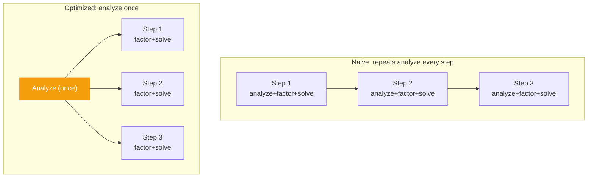
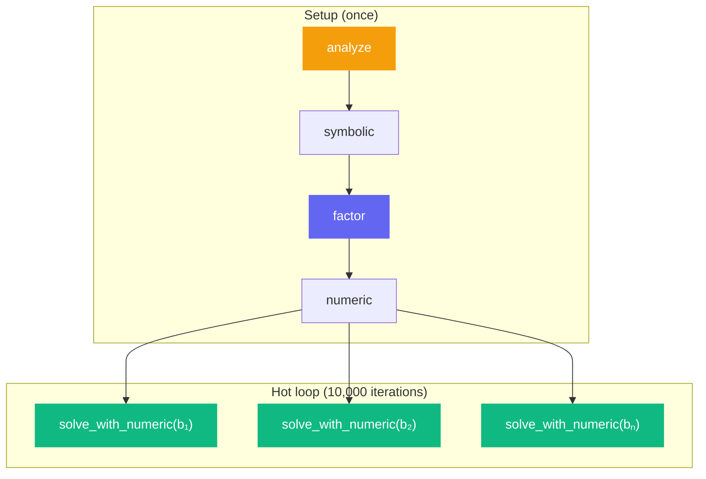
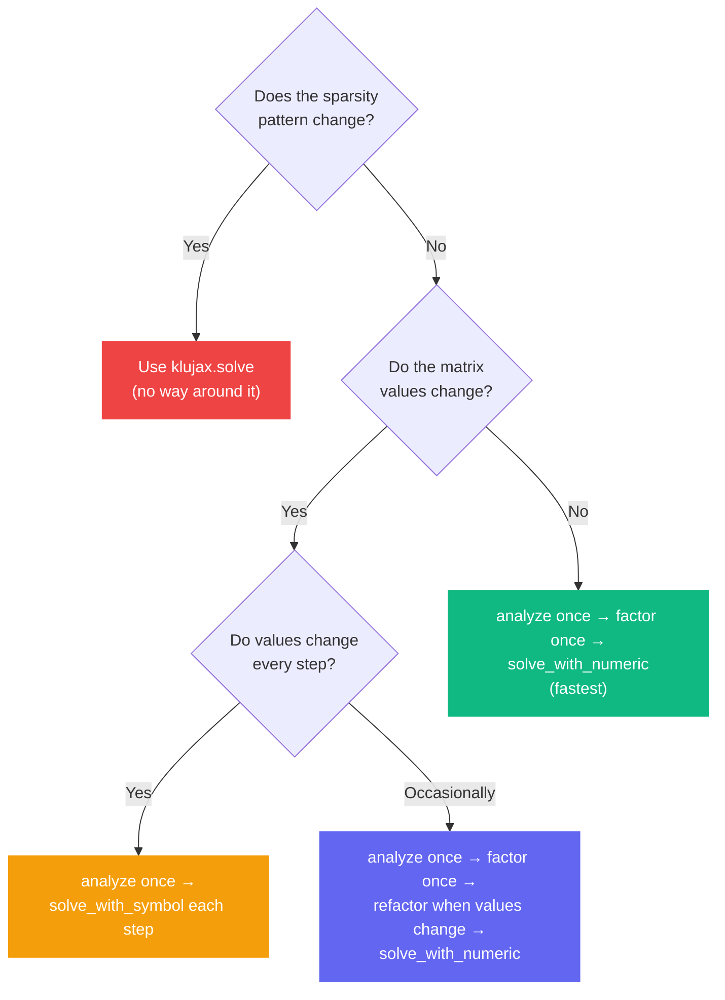

# High-Performance Loop

When solving many systems with the **same sparsity pattern** (but different values), you can get a large speedup by analyzing the pattern once and reusing the result.

## The Problem

In a typical simulation, you solve a sparse system at every time step. The matrix values change, but the sparsity pattern (which entries are nonzero) stays the same.



## The Solution

```python
import jax
import klujax
import jax.numpy as jnp

# Setup: sparsity pattern for a tridiagonal 100x100 matrix
n = 100
diag = jnp.arange(n, dtype=jnp.int32)
off_diag = jnp.arange(n - 1, dtype=jnp.int32)

Ai = jnp.concatenate([diag, off_diag, off_diag + 1])
Aj = jnp.concatenate([diag, off_diag + 1, off_diag])
n_col = n

# 1. ANALYZE ONCE (expensive, but only done once)
symbolic = klujax.analyze(Ai, Aj, n_col)

# 2. JIT-compiled solve that skips analysis
@jax.jit
def simulation_step(Ax, b, sym):
    return klujax.solve_with_symbol(Ai, Aj, Ax, b, sym)

# 3. Run many steps
for t in range(1000):
    # Matrix values change each step (e.g., temperature-dependent)
    Ax_t = compute_matrix(t)  # shape: (n_nz,)
    b_t = compute_rhs(t)      # shape: (n,)

    x_t = simulation_step(Ax_t, b_t, symbolic)
    process_result(x_t)
```

## How Much Faster?

The analyze step typically dominates for large matrices. By hoisting it out:

| Matrix Size | solve (all-in-one) | solve_with_symbol | Speedup |
| ----------- | ------------------ | ----------------- | ------- |
| 100×100     | ~0.5ms             | ~0.2ms            | ~2.5×   |
| 1000×1000   | ~5ms               | ~1ms              | ~5×     |
| 10000×10000 | ~50ms              | ~5ms              | ~10×    |

(Approximate — depends on sparsity and hardware.)

## Even Faster: Reuse Factorization

If the matrix doesn't change between solves (only b changes), skip factorization too:

```python
# Analyze pattern
symbolic = klujax.analyze(Ai, Aj, n_col)

# Factor once (with specific matrix values)
numeric = klujax.factor(Ai, Aj, Ax, symbolic)

@jax.jit
def fast_solve(b, num, sym):
    return klujax.solve_with_numeric(num, b, sym)

# Only substitution — extremely fast
for i in range(10_000):
    x = fast_solve(b_values[i], numeric, symbolic)
```



## With refactor: Matrix Updates

When the matrix changes but you want maximum speed, use `refactor` to update the factorization in-place:

```python
symbolic = klujax.analyze(Ai, Aj, n_col)
numeric = klujax.factor(Ai, Aj, Ax_initial, symbolic)

for t in range(1000):
    Ax_t = compute_matrix(t)

    # Update factorization in-place (faster than factor)
    numeric = klujax.refactor(Ai, Aj, Ax_t, numeric, symbolic)

    x_t = klujax.solve_with_numeric(numeric, b_t, symbolic)
```

## Decision Guide


