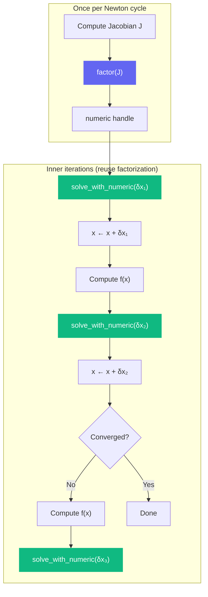

# Newton-Raphson Solver

The split solve API is tailor-made for Newton-Raphson iterations, where you factor the Jacobian once and solve repeatedly with different residuals.

## Background

Newton-Raphson finds the root of **f(x) = 0** by iterating:

1. Compute the Jacobian **J = ∂f/∂x** at current x
2. Solve **J · δx = -f(x)** for the update δx
3. Update **x ← x + δx**
4. Repeat until converged

The Jacobian factorization (step 2) is expensive. In a "modified Newton" approach, you factorize J once and reuse it for several iterations.

## The Pattern



## Implementation

```python
import jax
import klujax
import jax.numpy as jnp

def newton_solve(f, x0, Ai, Aj, n_col, tol=1e-10, max_iter=50):
    """Solve f(x) = 0 using modified Newton-Raphson.

    Args:
        f: function that returns (residual, Jacobian_values)
            where Jacobian_values are the COO values of the Jacobian
        x0: initial guess
        Ai, Aj: sparsity pattern of the Jacobian (constant)
        n_col: size of the system
        tol: convergence tolerance
        max_iter: maximum iterations
    """
    # Analyze the Jacobian pattern once
    symbolic = klujax.analyze(Ai, Aj, n_col)

    x = x0
    for iteration in range(max_iter):
        # Evaluate residual and Jacobian
        residual, Jx = f(x)

        # Check convergence
        if jnp.linalg.norm(residual) < tol:
            print(f"Converged in {iteration} iterations")
            break

        # Factor the Jacobian
        numeric = klujax.factor(Ai, Aj, Jx, symbolic)

        # Solve for the Newton step
        delta_x = klujax.solve_with_numeric(numeric, -residual, symbolic)

        # Update
        x = x + delta_x

    return x
```

## Concrete Example: Nonlinear Heat Equation

Solving a 1D nonlinear heat equation where thermal conductivity depends on temperature:

```python
import jax.numpy as jnp
import klujax

n = 50  # grid points

# Sparsity pattern: tridiagonal
diag = jnp.arange(n, dtype=jnp.int32)
lower = jnp.arange(1, n, dtype=jnp.int32)
upper = jnp.arange(n - 1, dtype=jnp.int32)

# COO indices for tridiagonal matrix
Ai = jnp.concatenate([diag, lower, upper])
Aj = jnp.concatenate([diag, upper, lower])
n_col = n

# Source term
source = jnp.zeros(n).at[n // 2].set(1.0)

def residual_and_jacobian(T):
    """Nonlinear residual and its Jacobian."""
    # k(T) = 1 + T^2 (temperature-dependent conductivity)
    k = 1.0 + T ** 2

    # Finite difference discretization
    dx = 1.0 / (n - 1)
    residual = jnp.zeros(n)

    # Interior points: -k_{i-1/2}(T_{i-1} - T_i) - k_{i+1/2}(T_{i+1} - T_i) = source
    k_half_left = 0.5 * (k[:-1] + k[1:])
    k_half_right = k_half_left

    flux = jnp.zeros(n)
    flux = flux.at[1:].add(-k_half_left * (T[:-1] - T[1:]) / dx**2)
    flux = flux.at[:-1].add(-k_half_right * (T[1:] - T[:-1]) / dx**2)
    residual = flux - source

    # Boundary conditions
    residual = residual.at[0].set(T[0])
    residual = residual.at[-1].set(T[-1])

    # Jacobian values (simplified — diagonal dominant)
    diag_vals = 2 * k / dx**2
    diag_vals = diag_vals.at[0].set(1.0).at[-1].set(1.0)
    off_vals = -k_half_left / dx**2

    Jx = jnp.concatenate([diag_vals, off_vals, off_vals])
    return residual, Jx

# Solve
T0 = jnp.zeros(n)
T = newton_solve(residual_and_jacobian, T0, Ai, Aj, n_col)
```

## Modified Newton with refactor

When the Jacobian changes slowly, use `refactor` instead of `factor` for a small speedup:

```python
symbolic = klujax.analyze(Ai, Aj, n_col)

# Initial factorization
_, Jx = f(x0)
numeric = klujax.factor(Ai, Aj, Jx, symbolic)

for iteration in range(max_iter):
    residual, Jx_new = f(x)

    # Refactor in-place (reuses memory)
    numeric = klujax.refactor(Ai, Aj, Jx_new, numeric, symbolic)

    delta_x = klujax.solve_with_numeric(numeric, -residual, symbolic)
    x = x + delta_x
```
