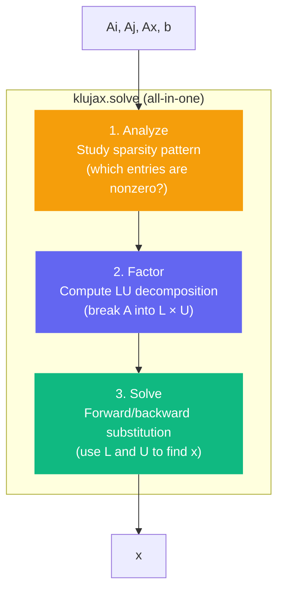

# Getting Started

## Installation

=== "pip"

    ```bash
    pip install klujax
    ```

=== "uv"

    ```bash
    uv add klujax
    ```

Pre-built wheels are available for Linux and Windows (Python 3.11+). If no wheel matches your platform, pip will build from source — see the [README](https://github.com/flaport/klujax#installing-from-source) for build dependencies.

## Your First Solve

Imagine you have a system of equations:

```
2x₁ + 3x₂         = 8
3x₁      + 4x₃ + 6x₅ = 45
    - x₂ - 3x₃ + 2x₄ = -3
           x₃         = 3
      4x₂ + 2x₃    + x₅ = 19
```

This is **Ax = b** where A is a 5×5 matrix. Most entries in A are zero — it's sparse.

### Step 1: Express A in COO Format

COO (Coordinate) format stores only the nonzero entries as three arrays:

- `Ai` — row index of each nonzero
- `Aj` — column index of each nonzero
- `Ax` — value of each nonzero

```python
import jax.numpy as jnp

Ai = jnp.array([0, 0, 1, 1, 1, 2, 2, 2, 3, 4, 4, 4], dtype=jnp.int32)
Aj = jnp.array([0, 1, 0, 2, 4, 1, 2, 3, 2, 1, 2, 4], dtype=jnp.int32)
Ax = jnp.array([2, 3, 3, 4, 6, -1, -3, 2, 1, 4, 2, 1], dtype=jnp.float64)
```

### Step 2: Define b and Solve

```python
import klujax

b = jnp.array([8.0, 45.0, -3.0, 3.0, 19.0])
x = klujax.solve(Ai, Aj, Ax, b)

print(x)  # [1. 2. 3. 4. 5.]
```

That's it. `klujax.solve` takes the sparse matrix and the right-hand side, and returns the solution.

### Step 3: Verify

```python
# Reconstruct A as a dense matrix and check
A_dense = jnp.zeros((5, 5))
A_dense = A_dense.at[Ai, Aj].set(Ax)

x_ref = jnp.linalg.solve(A_dense, b)
print(jnp.allclose(x, x_ref))  # True
```

## What's Happening Under the Hood



Every call to `klujax.solve` runs all three steps. For high-performance applications, you can split these steps apart — see the [Performance Guide](advanced/performance.md).

## JAX Features Work Out of the Box

```python
import jax

# JIT compilation
fast_solve = jax.jit(klujax.solve)
x = fast_solve(Ai, Aj, Ax, b)

# Automatic differentiation (w.r.t. Ax and b)
def loss(Ax, b):
    x = klujax.solve(Ai, Aj, Ax, b)
    return jnp.sum(x**2)

grad_Ax = jax.grad(loss, argnums=0)(Ax, b)

# Batched solves via vmap
# Solve 10 different systems with different Ax values
Ax_batch = jnp.stack([Ax] * 10)  # shape: (10, n_nz)
b_batch = jnp.stack([b] * 10)    # shape: (10, 5)
x_batch = jax.vmap(klujax.solve, in_axes=(None, None, 0, 0))(Ai, Aj, Ax_batch, b_batch)
```
