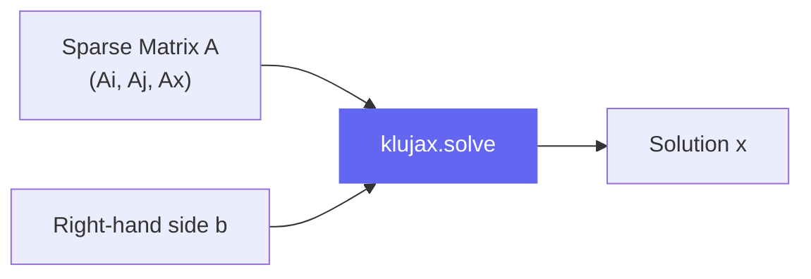

!!! note "this documentation was entirely generated by Claude Code."

# klujax

**klujax** is a sparse linear solver for [JAX](https://github.com/google/jax) built on top of the [KLU algorithm](https://ufdcimages.uflib.ufl.edu/UF/E0/01/17/21/00001/palamadai_e.pdf) from [SuiteSparse](https://github.com/DrTimothyAldenDavis/SuiteSparse).

It lets you solve equations of the form **Ax = b**, where **A** is a large sparse matrix (mostly zeros), and **b** is a known vector. The solver finds **x**.

## Why klujax?

Sparse matrices show up everywhere in engineering and science: circuit simulation, finite element analysis, power grid modeling, and more. These matrices can be enormous, but most of their entries are zero. KLU is one of the fastest algorithms for solving these kinds of systems, and klujax brings it into the JAX ecosystem with full support for:

- **JIT compilation** via `jax.jit`
- **Automatic differentiation** via `jax.grad`, `jax.jacfwd`, `jax.jacrev`
- **Vectorized batching** via `jax.vmap`

## Quick Example

```python
import klujax
import jax.numpy as jnp

# A 5x5 sparse matrix in COO format
Ai = jnp.array([0, 0, 1, 1, 1, 2, 2, 2, 3, 4, 4, 4])  # row indices
Aj = jnp.array([0, 1, 0, 2, 4, 1, 2, 3, 2, 1, 2, 4])  # col indices
Ax = jnp.array([2, 3, 3, 4, 6, -1, -3, 2, 1, 4, 2, 1], dtype=jnp.float64)

b = jnp.array([8.0, 45.0, -3.0, 3.0, 19.0])

x = klujax.solve(Ai, Aj, Ax, b)
print(x)  # [1. 2. 3. 4. 5.]
```

## At a Glance



## Constraints

- **CPU only** — KLU is a CPU algorithm. No GPU support.
- **float64 / complex128 only** — lower precision inputs are automatically upcast.
- Sparse matrices must be in **COO format** (coordinate format).
- Duplicate indices must be **coalesced** before solving (use `klujax.coalesce`).

## What's Next?

- [Getting Started](getting-started.md) — install and run your first solve
- [Core Concepts](concepts.md) — understand sparse matrices, COO format, and what KLU does
- [API Reference](api/solve.md) — detailed docs for every function
- [Examples](examples/basic-solve.md) — practical code you can copy-paste
